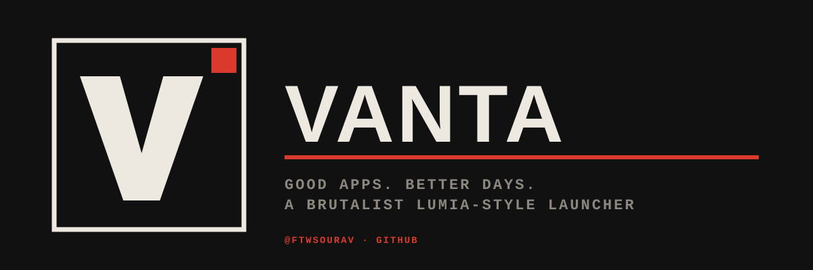

<p align="center"></p>

# Vanta

> Good apps. Better days.

[](https://github.com/ftwsourav/vanta-launcher/releases/latest)
[](https://github.com/ftwsourav/vanta-launcher/releases)


**Current version: v5.4 "Turnstile"** — [download the APK](https://github.com/ftwsourav/vanta-launcher/releases/download/v5.4/Vanta-v5.4-release.apk) · [release notes](https://github.com/ftwsourav/vanta-launcher/releases/tag/v5.4) · [full changelog](PROGRESS_CHANGELOG.md)

## What's new in 5.4
- Tiles turnstile in around the left edge every time you return to the launcher; apps reveal out of their own tile.
- Windows 8.1 edge-pivot, WP7 turnstile and parallax page transitions, all in the draw phase at 120 Hz.
- Edge-swipe gesture actions, Windows Phone toggle switches, semantic-zoom A–Z grid, brutalist quick settings.
- Live page now shows every app's notifications, with swipe-to-dismiss cards.
- New mark: ink tile, paper outline, display-weight V, one red accent square.

A brutalist Android launcher replacement inspired by Windows Phone 8.1 / Lumia Metro UI. Built with Kotlin + Jetpack Compose. Targets Android 14+ with 120Hz smoothness.

**Developer:** [@ftwsourav](https://github.com/ftwsourav)

---

## Download

Grab the latest APK from the [Releases page](https://github.com/ftwsourav/vanta-launcher/releases). Install it on your phone and set as your default launcher.

## Features

### Home Screen
- **Live Tiles** — every tile cycles through frames (icon+label → text-only → icon-only) at random intervals with Lumia-style 3D Y-axis flip
- **Music Widget** — album art, transport controls (⏮ ▶/⏸ ⏭), 5-bar visualizer, queue/favorite/shuffle buttons
- **Tasks Widget** — todo list with checkboxes, add/remove, persisted
- **Notes Widget** — quick notes, last 2 shown, inline add
- **Battery Tile** — animated count-up percentage with charging/low states
- **People Hub** — contacts with initial avatars, tap to dial
- **Weather Tile** — real Open-Meteo data, 3-day forecast, live conditions
- **Floating Search Bar** — expandable, live-filters pinned apps
- **Quick Settings** — pull down from the header for a WiFi/BT/DND/flashlight/rotate/airplane/brightness sheet

### Tile Management
- **Drag-to-reorder** — immediate drag in edit mode, tile lifts with shadow + scale
- **Drag-to-resize** — drag corner triangle to grow/shrink tiles
- **4 Tile Sizes** — SMALL (1×1), MEDIUM (2×2), WIDE (4×2), LARGE (4×4)
- **Turnstile motion** — tiles swing in around the left edge on every return to the launcher, and apps reveal out of their tile
- **Long-press context menu** — Resize/Move/Pin/Remove/App Info/Add Widget

### Navigation
- **4-page pivot** — Home / Apps / Focus / Live with Windows 8.1 edge-pivot, WP7 turnstile or parallax transitions
- **Edge swipe** — pull from either screen edge for your configured gesture action (next/prev page, search, focus, live)
- **Smoothness presets** — SNAPPY / SMOOTH / LUXURIOUS / BOUNCY / GLASS

### Apps Drawer
- **Alphabetical** with letter headers
- **Alphabet scrubber** rail for fast jumping
- **Semantic zoom** — tap a letter header (or pinch) for the Windows Phone A–Z letter grid
- **App icons** shown on every row
- **WP-style app bar** at bottom

### Focus Mode
- **Stopwatch** — count-up timer with progress ring, laps
- **Productivity suggestions** — Keep, Todoist, MS To Do, Evernote
- **Quick notes** — add notes with dialog
- **Focus apps** — 2×2 grid of your focus apps

### Design
- **6 themes** — Mono, Blue, Red, Green, Purple, Orange
- **Dark/Light mode** with animated crossfade
- **Time-of-day palette tint** — colors shift through dawn/day/dusk/night/midnight
- **Icon theming** — Original, Monochrome, Accent-tinted, Text-only, Circle, Rounded-square
- **Wallpaper background** — device wallpaper behind tiles
- **Parallax background** — drifts behind tiles on scroll
- **Drifting noise overlay** — subtle paper grain texture
- **Space Grotesk + JetBrains Mono** typography
- **120fps** support

### Motion
- **Cinematic intro** — 800ms 3-phase splash (shard fall + grain burst)
- **Glance screen** — large clock, tap to dismiss
- **Turnstile transition** — tile scales up to fullscreen on app launch
- **Home return transition** — content fades + scales in smoothly
- **Tile motion** — breathing scale, idle shimmer, scroll-linked 3D tilt, accent pulse
- **Spring animations** everywhere with configurable smoothness

### Settings
- Theme picker, dark mode, paper grain, noise drift
- Time-of-day tint, wallpaper background
- Live tiles, random flip timing, notification previews
- Smoothness picker (5 levels)
- Icon style (6 styles)
- Animation style (Tap-flip / 3D Cube / Smooth)
- Cinematic intro, glance, haptics
- Weather location + units + clock format
- Quotes editor
- Developer credit: @ftwsourav

## Tech Stack

| | |
|---|---|
| Language | Kotlin 2.0 |
| UI | Jetpack Compose (BOM 2024.12) |
| Architecture | MVVM + Repository pattern |
| Min SDK | 30 (Android 11) |
| Target SDK | 34 (Android 14) |
| Compile SDK | 35 |
| Build | Gradle 8.9 |
| Fonts | Space Grotesk + JetBrains Mono |

## Building

```bash
git clone https://github.com/ftwsourav/vanta-launcher.git
cd vanta-launcher/standard-launcher
./gradlew assembleDebug
```

APK output: `app/build/outputs/apk/debug/app-debug.apk`

## License

This project is open source. Feel free to fork and modify.

---

**Developed by [@ftwsourav](https://github.com/ftwsourav) · GitHub**
